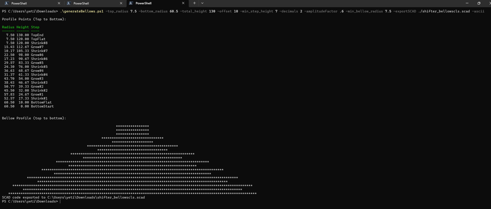

# Tools
Non-specific tools that are not inherently Rx-7 related but have purpose.

:bulb: You might need to unblock the execution of this file before running locally. Please search online for how to do this. Search terms can be: _"this file came from another computer and might be blocked"_

## generateBellows.ps1
This is a Powershell script that generates bellows for openSCAD. Afterwhich, you may export the model and print.

Usage is well-documented at the beginning of the script.

